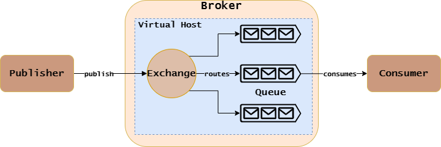
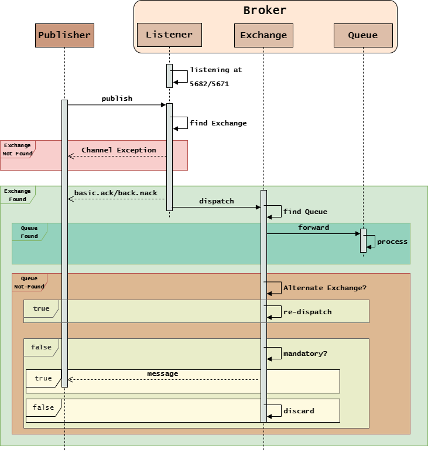
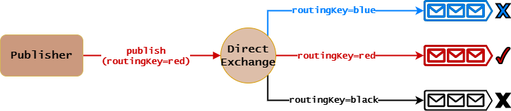
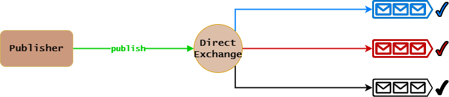
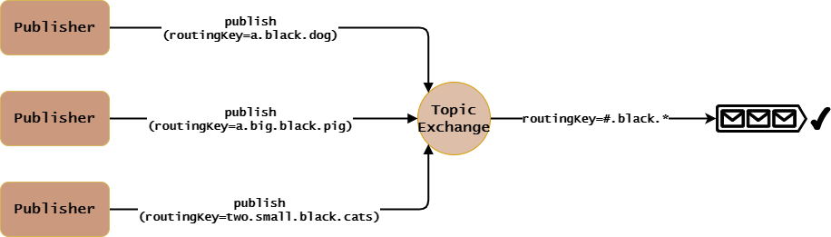
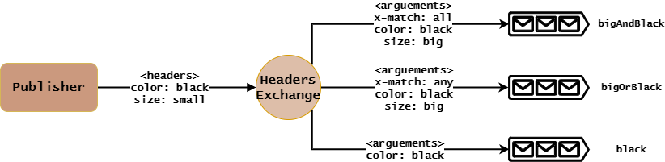

> 上一篇文章（[RabbitMQ：下载 & 安装](./RabbitMQ：下载 & 安装.md)）中，我们下载并且安装了RabbitMQ，并且成功注册了RabbitMQ服务。
>
> 本文我们将学习RabbitMQ中最基础、最重要的概念：AMQP 0-9-1协议模型。
>
> 本文主要讲解理论知识，对应代码参看后续文章。

# 0 前言

 要学好一项技术，千万不要死记硬背那些调用API，而是要理解它的执行逻辑。

RabbitMQ的执行逻辑本质上是它所支持的通讯协议。

RabbitMQ支持很多通讯协议，包括AMQP 0-9-1、AMQP 1.0、MQTT和STOMP等。其中，最重要、最常用的是AMQP 0-9-1（默认）。我们只需要充分理解这个协议，就能够解决日常工作中绝大部分RabbitMQ相关的问题。

AMQP（Advanced Message Queuing Protocol，高级消息队列协议）是二进制消息协议，即底层传输的消息是二进制数据。它的版本划分方式为*major-minor[-revision]*或*major.minor[.revision]*。AMQP 0-9-1是AMQP的0-9-1版本（major=0，minor=9，rivision=1）。

从本质上来看，AMQP 0-9-1具备两个核心功能：

- 接收消息。
- 转发消息。

为了实现这两个功能，AMQP 0-9-1提出了两方面规范：

- 在服务端层面，提出了**AMQ Model**（Advanced Message Queuing Protocol
  Model，高级消息队列协议模型）：由一系列具备路由/存储消息功能的组件，以及组件之间交互的规则组成。
- 在网络传输层面，提出了在AMQ模型下客户端与服务端以及组件之间交互的规范，具体可以分成两部分：
  - 方法层（Functional Layer）：规范了客户端与服务端之间、AMQ模型之间的命令。
  - 传输层（Transport Layer）：规范了二进制数据（包括命令和消息）的传输格式。

因此，学习AMQP 0-9-1的核心内容可以分成上述三个部分：AMQ 模型、方法和传输数据格式。

本文介绍的是第一部分：AMQ 模型。其余两部分可查看后续文章。

# 1 AMQ模型

再次回顾**AMQ Model**的定义：由一系列具备路由/存储消息功能的组件，以及组件之间交互的规则组成。

其中，核心组件包括：

- Exchange（交换机）。
- Message Queue（消息队列）。
- Binding（绑定）

其他重要的基本概念包括：Message、Connection、Channel以及Virtual Host。

消息中间件工作方式是典型的C/S模式，通常将服务器中运行的消息中间件程序称为Broker，而发布和接收消息的客户端应用程序分别称为Publisher和Consumer。

AMQ Model的组件就工作于Broker的消息中间件（如rabbitmq-server）进程中。为了方便统一管理，在创建时需要为这些组件指定对应的Virtual Host（类似于Java中的包）。

因此，AMQ模型的结构图以及工作流程如下：



1. Publisher和Consumer使用客户端工具（如rabbitmq的amqp-client），通过TCP/IP协议连接到指定的Broker。
2. 服务端或客户端创建Exchange和Queue，并使用Binding组件进行绑定。
3. Consumer监听Queue。
4. Publisher指定某个Virtual Host下的Exchange和路由规则，发送消息。
5. Broker中对应的Exchange接收到消息后，根据路由规则将消息转发给所绑定的某个/某些Queue。
6. Queue将消息推送给正在监听它的Consumer。

AMQP协议的主要特点是将路由和存储消息的功能分给交给Exchange和Message Queue组件，而在AMQP之前的消息队列协议通常将路由和存储消息定义在同一个功能组件中。这样做的好处在于可以实现更灵活、多样和健壮的消息中间件系统。

# 2 Exchange

## 2.1 工作流程

Exchange的作用是：接收从Publisher发来的消息，然后根据路由规则转发消息给Message Queue。

需要注意的是，在这个过程中Exchange并不会保存消息。如果能找到匹配的Message Queue，那么消息就能够成功转发。但是如果匹配失败，Exchange会根据自身是否存在替补交换机（Alternate Exchange）进行重新分发消息，也会根据Publisher发布消息是否指定为`mandatory`进行丢弃或返回给Publisher。

同时，为了保证数据安全，如果手动开启了Publisher确认机制，当消息被Broker中的Exchange接收时会返回一个确认消息`basic.ack`，如果没有Exchange能够接收则会响应异常信息。后续文章会深入讨论确认机制的细节。

因此，考虑到所有常见情况，Exchange工作的基本流程是：



1. Broker监听服务器的5682（non-ssl）或5671（ssl）端口。
2. Publisher指定Exchange和路由规则，发送消息给Broker。
3. Broker接收到消息：
   1. 未找到Exchange：响应Channel级别异常给Publisher，终止流程。
   2. 找到Exchange：分发消息给对应的Exchange，同时响应`basic.ack`给Publisher，进行下一步。
4. Exchange解析路由规则：
   1. 找到Message Queue：转发消息到对应的Message Queue，终止流程。
   2. 未找到Message Queue，判断是否存在替补交换机：
      1. 存在：重新分发消息给替补交换机，替补交换机按照自己的方式解析路由规则。
      2. 不存在，判断`mandatory`属性：
         1. `false`，丢弃消息，终止流程。
         2. `true`：返回消息给Publisher，终止流程。

## 2.2 交换机类型

Exchange本质上是一种路由算法，它会分析发布消息时指定的routingKey或headers，从Binding列表中找到匹配的Queue进行转发。

为了适应不同的路由情况，AMQP 0-9-1预先定义了几种不同类型的Exchange，分别对应不同的路由算法：

- Direct Exchange
- Faout Exchange
- Topic Exchange
- Headers Exchange
- System Exchange

这些交换机类型足以满足日常工作中的各种场景。

RabbitMQ实现了前四种，并在Broker中默认创建了如下Exchange实例：

- ` `（AMQP default）：Direct Exchange，发布消息不指定交换机时会默认发送到该交换机。
- `amq.direct`：Direct Exchange。
- `amq.faout`：Faout Exchange。
- `amq.headers`：Headers Exchange。
- `amq.match`：Headers Exchange。
- `amq.rabbitmq.trace`：Topic Exchange。
- `amq.topic`：Topic Exchange。

### 1、Direct Exchange

Direct Exchange工作原理：



1. Queue绑定到Direct Exchange时需要指定`routingKey`。
2. Publisher发布消息给Direct Exchange时需要指定`routingKey`的值。
3. Direct Exchange接收到消息时，会执行如下路由算法：
   1. 读取`routingKey`值。
   2. 遍历与之绑定的Queue列表，找到所有`routingKey`匹配的Queue。
   3. 转发消息给匹配Queue。

很明显，上面原理图中，Direct Exchange会将消息转发给`routingKey=red`的Queue。

特别需要注意的是，Direct Exchange路由算法的唯一指标是`routingKey`。同时，它会将消息转发给所有匹配的Queue，而不是说找到了一个匹配的Queue就停止遍历了。

RabbitMQ默认创建了名为` `（空字符串）的默认Direct Exchange，它会自动与所有Queue绑定，并指定`routingKey`为队列名。因此，在向默认交换机发送消息时可以直接将`routingKey`指定为队列名。

此外，日常工作中也习惯将`routingKey`与队列名使用相同值，所以容易引起混淆，让人们误以为Direct Exchange是根据队列名进行路由的。

### 2、Faout Exchange

Faout Exchange工作原理：



1. Queue绑定到Faout Exchange时不需要指定参数。
2. Publisher发布消息给Faout Exchange时也不需要指定参数。
3. Faout Exchange会无条件将消息转发给所有与它绑定的Queue。

很明显，上面原理图中，Faout Exchange会将消息同时转发给与它绑定的三个Queue。

特别需要注意的是，Faout Exchange路由算法没有路由指标，它会将消息转发给所有与它绑定的Queue。

Faout Exchange的原理与计算机网络中的组播类似，通常用于实现发布/订阅场景。

### 3、Topic Exchange

Topic Exchange工作原理：



1. Queue绑定到Topic Exchange时需要指定`routingKey`，其值通常为以“.”分隔的多个单词。使用通配符`#`或`*`进行模糊匹配：
   1. `#`：匹配零或多个单词。
   2. `*`：匹配一个单词。
2. Publisher发布消息给Topic Exchange时需要指定`routingKey`，其值为确定值（即没有通配符的概念）。
3. Topic Exchange接收到消息时，会执行如下路由算法：
   1. 读取`routingKey`值。
   2. 遍历与之绑定的Queue列表，找到所有`routingKey`匹配的Queue。
   3. 转发消息给匹配Queue。

很明显，上面原理图中，Topic Exchange会将两条消息都转发给`routingKey=#.black.*`的Queue。

特别需要注意的是，Topic Exchange路由算法的唯一指标也是`routingKey`。同时，它会将消息转发给所有匹配的Queue，而不是说找到了一个匹配的Queue就停止遍历了。

将Direct Exchange和Topic Exchange进行对比，可以很明显地发现：

- Direct Exchange是低配版的Topic Exchange，`routingKey`与Queue之间为一对一关系：一个Queue只能接收`routingKey`唯一对应的消息。
- Topic Exchange是高配版的Direct Exchange，`routingKey`与Queue之间为多对一关系：一个Queue可以接收多种`routingKey`的消息。

### 4、Headers Exchange

Headers Exchange工作原理：



1. Queue绑定到Headers Exchange时需要指定`arguement`作为匹配条件，其值为key-value键值对。多个key-value键值对时，可以使用`x-match`指定多条件匹配关系：
   1. `all`：所有key-value键值对都要匹配才会进行转发，即匹配条件之间为“且”的关系。默认值。
   2. `any`：只要有一个key-value键值对匹配就会进行转发，即匹配条件之间为“或”的关系。
2. Publisher发布消息给Headers Exchange时需要指定`headers`，此时不需要添加`x-match`。
3. headers Exchange接收到消息时，会执行如下路由算法：
   1. 读取请求`headers`。
   2. 遍历绑定的Queue列表，读取绑定`arguement`。
   3. 判断绑定`arguement`的`x-match`值：
      1. `all`或没有声明`x-match`：绑定`arguement`中所有key-value在请求`headers`中都存在且匹配则成功，否则失败。
      2. `any`：绑定`arguement`中只要有一个key-value键值对在请求`headers`中存在且匹配就成功，所有绑定`arguement`的key-value键值对在请求`headers`中都不存在或不匹配才失败。
   4. 转发消息给匹配Queue。

很明显，上面原理图中，Headers Exchange会将消息转发给`bigOrBlack`和`black`队列。

### 5、System Exchange

System Exchange的工作原理为：

1. Publisher向System Exchange发送`routingKey=S`的消息。
2. System Exchange会将该消息转发给名为`S`的系统服务。

RabbitMQ默认没有支持该类型交换机，所以在这里不进行过多讲解。

## 2.3 交换机属性

通过导出RabbitMQ的`Definitions`，我们可以得到Broker中的许多配置信息，从中我们可以找到交换机数据结构的存储格式如下：

```json
"exchanges": [
  {
    "name": "test.exchange",
    "vhost": "/",
    "type": "direct",
    "durable": true,
    "auto_delete": false,
    "internal": false,
    "arguments": {
      "alternate-exchange": "amq.direct",
      "testArgumentsName": "testArgumentsValue"
    }
  }
]
```

- `exchanges`：存放交换机实例的数组，内部每一个对象表示一个交换机实例。
- `name`：交换机名字。
- `vhost`：交换机所属Virtual Host。
- `type`：交换机类型，RabbitMQ中可选值为`direct`、`faout`、`topic`和`headers`。
- `durable`：是否可以持久化，可选值为`true`（持久化）和`false`（非持久化）。持久化交换机会保存到本地磁盘，Broker重启后能获取原有交换机数据。
- `auto_delete`：是否自动删除，可选值为`true`和`false`：
  - `true`：当该交换机没有与之绑定的消息队列时，会被自动删除。
  - `false`：当该交换机没有与之绑定的消息队列时，不会被删除，仍然可以独立存在。
- `internal`：是否时内部使用的交换机，可选值为`true`和`false`。
  - `true`：内部使用交换机，Publisher不能指定发送消息给内部交换机。
  - `false`：外部使用交换机，Publisher可以将消息发送给外部交换机。通常我们声明的都是外部使用交换机。
- `arguments`：可选参数，内部为key-value键值对，可用于完成特定功能。例如，`alternate-exchange`可指定替补交换机。

# 3 Message Queue

Message Queue是

# 4 Binding

【绑定的作用/工作原理】

# 5 Message

# 6 Connection & Channel

# 7 Virtual Host

【虚拟主机的作用】