> RabbitMQ是基于Erlang语言开发的消息中间件，所以使用RabbitMQ需要安装Erlang和RabbitMQ两个软件。

# 1 Erlang

## 1.1 下载

官网下载地址：https://www.erlang.org/downloads

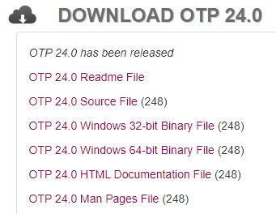

32位点击：`OTP 24.0 Windows 32-bit Binary File`。

64位点击：`OTP 24.0 Windows 64-bit Binary File`。


如果要使用其他版本，可在网页右侧的`Available releases`中进行选择：

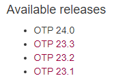


由于Erlang官网下载很慢，最好借助下载工具进行下载。下载完成后可以保存到自己的网盘中，便于下次安装。

## 1.2 安装

1. 双击下载后的`otp_win64_24.0.exe`：

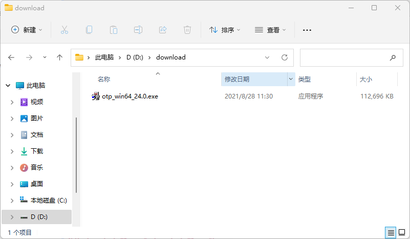

2. 点击`Next`：

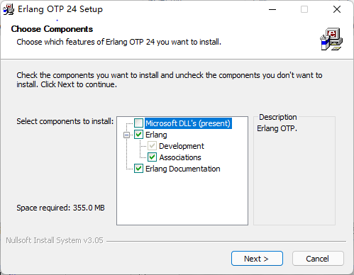

3. 选择安装目录，然后`Next`：

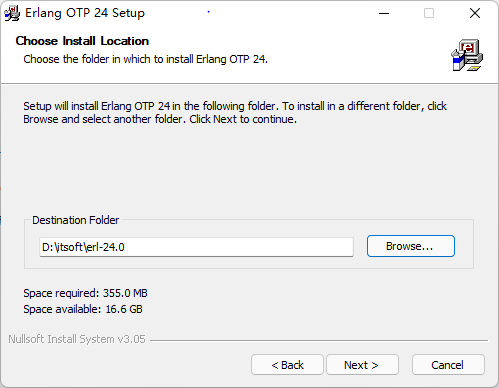

4. 点击`Install`：

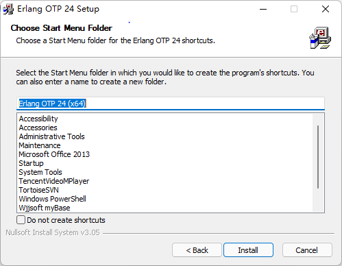

5. 等待安装：

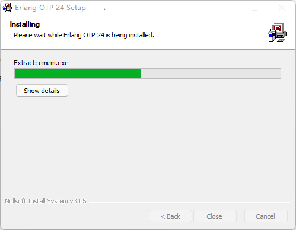

6. 安装完成后，点击`Close`：

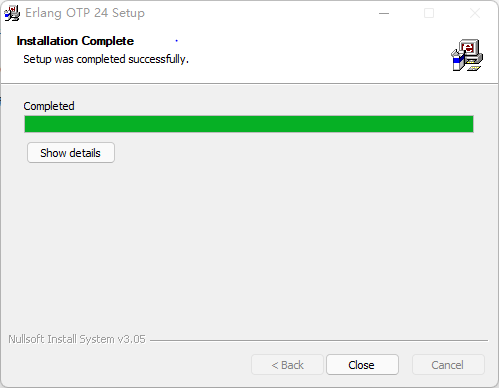

## 1.3 配置环境变量

将之前安装路径下`bin`目录的路径添加到`Path`环境变量中，点击`确定`：

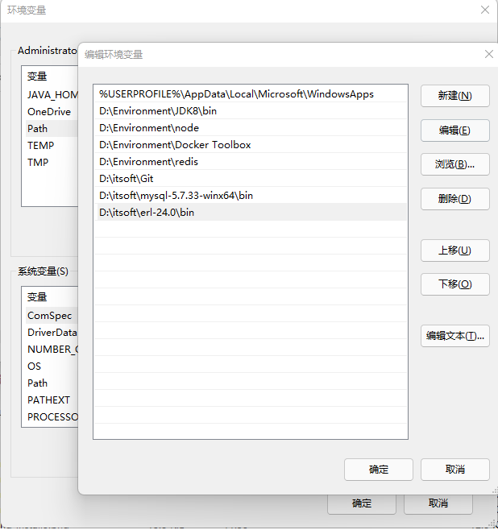

## 1.4 测试

1. 按下`Win`+`R`，打开`cmd`：

   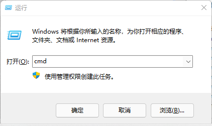

2. 命令行中输入`erl`，然后回车。出现如下结果表明安装成功：

```bash
C:UsersAdministrator>erl
Eshell V12.0  (abort with ^G)
1>
```

# 2 RabbitMQ

## 2.1 下载

GitHub下载地址：https://github.com/rabbitmq/rabbitmq-server/releases


在`Assets`中找到对应的系统版本，Windows点击`rabbitmq-server-windows-3.9.5.zip`：


## 2.2 安装

下载完成后只需要解压安装包，然后放到自己任意目录下即可。

## 2.3 配置环境变量

将之前安装路径下`sbin`目录的路径添加到`Path`环境变量中，点击`确定`：

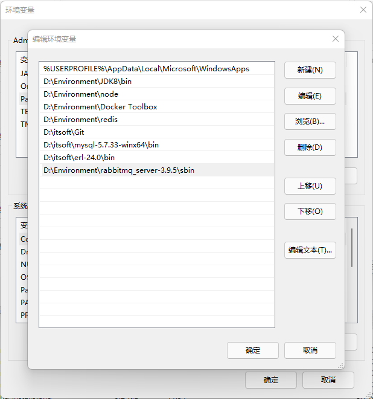

## 2.4 测试

1. 按下`Win`+`R`，打开`cmd`：


2. 命令行中输入`rabbitmq-server`，然后回车。出现如下结果表明安装成功：

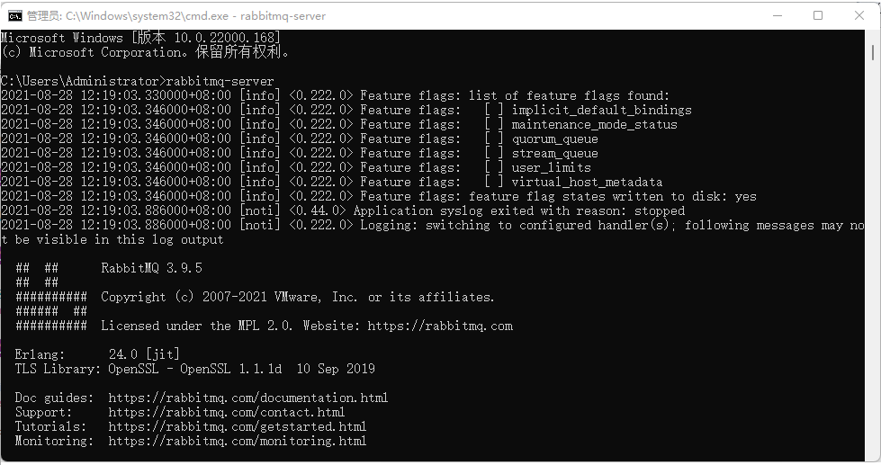

## 2.5 启动服务

为了不必每次开发都需要重新启动RabbitMQ，可以把它安装成服务。相关命令如下：

```bash
rabbitmq-service install 安装服务
rabbitmq-service start  开始服务
rabbitmq-service stop  停止服务
```

例如：

```bash
C:UsersAdministrator>rabbitmq-service install

D:itsofterl-24.0erts-12.0binerlsrv: Service RabbitMQ added to system.
C:UsersAdministrator>rabbitmq-service start
RabbitMQ 服务正在启动 .
RabbitMQ 服务已经启动成功。
```