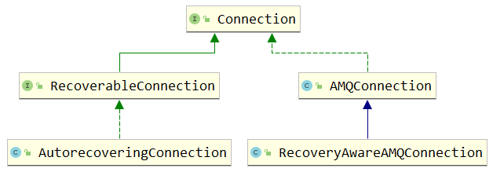
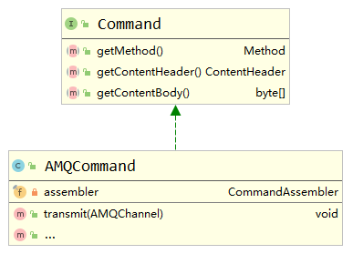

> 本文简要介绍RabbitMQ提供的Java客户端中最基本的功能性接口/类及相关源码。

Mavan依赖：

```xml
<dependency>
    <groupId>com.rabbitmq</groupId>
    <artifactId>amqp-client</artifactId>
    <version>5.13.1</version>
</dependency>
```

# 0 `AMQP`

`com.rabbitmq.client.AMQP`接口将AMQP（Advanced Message Queue Protocol，高级消息队列协议）中的方法和消息属性封装成Java对象，便于以面向对象的思维模式进行编程。

该接口类图简要如下：


`AMQP`接口中包含许多内部类，大体可以分成三类：

## 0.1 协议信息

`PROTOCOL`内部类，保存了AMQP的协议版本等信息。

```java
public static class PROTOCOL {
    public static final int MAJOR = 0;
    public static final int MINOR = 9;
    public static final int REVISION = 1;
    public static final int PORT = 5672;
}
```

## 0.2 方法

包括`Connection`、`Channel`、`Access`、`Exchange`、`Queue`、`Basic`、`Tx`和`Confirm`内部类，分别封装了向`Broker`发送的不同方法的基本数据格式和内容。

它们都实现了`com.rabbitmq.client.impl.Method`抽象类（后续会介绍），在发送请求时，通过`Method`抽象类的`toFrame()`方法可以转换成`Frame`（帧），然后`com.rabbitmq.client.impl.AMQConnection`将其以二进制数据的方式通过`TCP`协议发送给`Broker`。

它们都提供了各自的`Builder`，便于实例化方法对象（建造者模式）。例如，最常用的`Publish`方法类图简要如下：


通过如下代码实例化出`Publish`对象：

```java
AMQP.Basic.Publish publish = new AMQP.Basic.Publish.Builder().exchange("myExchange").routingKey("myRoutingKey").mandatory(true).build();
```

在发送给`Broker`前可以通过如下代码将`Publish`对象转成帧：

```java
Method method = (Method) publish;
Frame frame = method.toFrame(1);
```

`com.rabbitmq.client.impl.AMQConnection`对象管理着与`Broker`的连接，它通过如下代码将方法发送给`Broker`：

```Java
AMQConnection connection = channel.getConnection();
connection.writeFrame(frame);
```

## 0.3 消息属性

`BasicProperties`内部类，封装了消息的基本属性。

它也提供了`Builder`，我们在发送消息时可以使用`BasicProperties`实例携带消息头信息，类图如下：


通过如下代码实例化出`BasicProperties`对象，并发送消息：

```Java
Map<String, Object> headers = new HashMap<>();
headers.put("color", "blue");
AMQP.BasicProperties properties = new AMQP.BasicProperties.Builder().headers(headers).expiration("10000").build();
channel.basicPublish("myExchange", "myRoutingKey", true, properties, "hello".getBytes());
```

`BasicProperties`对象在发送前最终会被转换成`com.rabbitmq.client.impl.AMQContentHeader`对象，代表`AMQ`消息内容的头。


`AMQContentHeader`的`toFrame()`方法也可以将其转换成`Frame`（帧），然后`com.rabbitmq.client.impl.AMQConnection`将其以二进制数据的方式通过`TCP`协议发送给`Broker`。

```java
AMQConnection connection = channel.getConnection();
Frame headerFrame = contentHeader.toFrame(channelNumber, body.length);
connection.writeFrame(headerFrame);
```

# 1 `ConnectionFactory`

`com.rabbitmq.client.ConnectionFactory`类是用来创建与RabbitMQ服务器连接（`com.rabbitmq.client.Connection`）的工厂类。简要类图如下：


`ConnectionFactory`内部封装了许多属性，用来设置与`Connection`或`Socket`相关的连接信息。

它还提供了一套默认配置：

```Java
public static final String DEFAULT_VHOST = "/";
public static final String DEFAULT_HOST = "localhost";
public static final int    DEFAULT_AMQP_PORT = AMQP.PROTOCOL.PORT; // 5672
public static final int    DEFAULT_AMQP_OVER_SSL_PORT = 5671;
public static final String DEFAULT_PASS = "guest";	// CredentialsProvider.username
public static final String DEFAULT_USER = "guest";	// CredentialsProvider.password
private boolean nio = false;
private boolean automaticRecovery               = true;
```

`ConnectionFactory`的基本使用如下：

```java
ConnectionFactory connectionFactory = new ConnectionFactory();
Connection connection = connectionFactory.newConnection();//返回RecoveryAwareAMQConnection或AMQConnection对象
```

底层会创建出`java.net.Socket`或`java.nio.channels.SocketChannel`，代表与RabbitMQ服务器的`TCP`连接：

```Java
Socket socket = SocketFactory.getDefault().createSocket();
SocketChannel channel = SocketChannel.open();
```

`Socket`或`SocketChannel`会被封装到`com.rabbitmq.client.impl.FrameHandler`中：

```Java
// nio==false，使用Socket（默认值）
SocketFrameHandler frameHandler = new SocketFrameHandler(sock, this.shutdownExecutor);
// nio==true，使用SocketChannel
SocketChannelFrameHandlerState state = new SocketChannelFrameHandlerState(
                    channel,
                    nioLoopContext,
                    nioParams,
                    sslEngine
                );
SocketChannelFrameHandler frameHandler = new SocketChannelFrameHandler(state);
```

`FrameHandler`中提供了`readFrame()`和`writeFrame()`，分别可以从`Socket/SocketChannel`中读取或写入数据。


`FrameHandler`又会被封装到`com.rabbitmq.client.impl.recovery.RecoveryAwareAMQConnection`或`com.rabbitmq.client.impl.AMQConnection`中：

```
// automaticRecovery==true，默认值
FrameHandler frameHandler = factory.create(addr, connectionName());
RecoveryAwareAMQConnection conn = createConnection(params, frameHandler, metricsCollector);
// automaticRecovery==false
FrameHandler handler = fhFactory.create(addr, clientProvidedName);
AMQConnection conn = createConnection(params, handler, metricsCollector);
```

因此，我们可以使用返回的`Connection`对象与RabbitMQ服务器进行交互。

# 2 `Connection`

`com.rabbitmq.client.Connection`接口代表与RabbitMQ服务器的TCP连接，类图简要如下：


`Connection`主要提供了`createChannel()`和`openChannel()`方法，用来创建`Channel`。后者提供了几乎所有与RabbitMQ进行交互的方法，是项目中使用频率最高的一个接口。

`Connection`的基本使用如下：

```java
Channe channel = connection.createChannel();
```

`Connection`的实现类主要包括以下几种，分别代表不同类型的连接：



- `AMQConnection`类：代表最基本的与RabbitMQ服务器的连接。内部持有`FrameHandler`等成员变量，用来与服务器交互。
- `RecoveryAwareAMQConnection`接口：代表自动重连的连接，内部没有方法，类似与标志性接口。
- `AutorecoveringConnection`类：自动重连`Connection`的实现类，在非正常断开情况下会自动重连，例如`I/O`异常。它持有`RecoveryAwareAMQConnection`对象作为代理，从而间接可以使用`FrameHandler`对象与服务器进行交互。重连时，内部组件也会按如下顺序自动重连：
  - `Exchanges`
  - `Queues`
  - `Bindings` (both queue and exchange-to-exchange)
  - `Consumers`
- `RecoveryAwareAMQConnection`：它是对`AMQConnection`的修改，主要用作`AutorecoveringConnection`的成员变量。它与`AMQConnection`主要区别在于它内部使用`com.rabbitmq.client.impl.recovery.RecoveryAwareChannelN`作为`Channel`。

在项目中使用的实现类主要为`AMQConnection`和`AutorecoveringConnection`（根据`ConnectionFactory`的`automaticRecovery`成员变量进行选择）。

`AMQConnection.createChannel()`方法会使用`ChannelManager`创建出`ChannelN`类型的通道：

```Java
ChannelManager cm = _channelManager;
Channel channel = cm.createChannel(this);
// 底层：
new ChannelN(connection, channelNumber, workService, this.metricsCollector);
```

而`AutorecoveringConnection.createChannel()`方法会使用`RecoveryAwareAMQConnection`创建出`RecoveryAwareChannelN`类型的通道，并使用`AutorecoveringChannel`包装：

```Java
RecoveryAwareChannelN ch = (RecoveryAwareChannelN) delegate.createChannel();
final AutorecoveringChannel channel = new AutorecoveringChannel(this, delegateChannel);
```

`AMQConnection`中有一个十分重要的方法`writeFrame()`，可以将数据发送给RabbitMQ服务器：

```Java
public void writeFrame(Frame f) throws IOException {
    _frameHandler.writeFrame(f);
    _heartbeatSender.signalActivity();
}

// SocketFrameHandler
public void writeFrame(Frame frame) throws IOException {
    synchronized (_outputStream) {
        frame.writeTo(_outputStream);
    }
}
public void writeTo(DataOutputStream os) throws IOException {
    os.writeByte(type);
    os.writeShort(channel);
    if (accumulator != null) {
        os.writeInt(accumulator.size());
        accumulator.writeTo(os);
    } else {
        os.writeInt(payload.length);
        os.write(payload);
    }
    os.write(AMQP.FRAME_END);
}
```

# 3 `Channel`

`com.rabbitmq.client.Channel`中封装了与RabbitMQ服务器交互的API，简要类图如下：


`Channel`的基本使用方式如下：

```Java
// 声明交换机
channel.exchangeDeclare("myExchange", BuiltinExchangeType.DIRECT);
// 声明队列
channel.queueDeclare("myQueue", true, false, false, null);
// 声明绑定
channel.exchangeBind("myQueue", "myExchange", "myRoutingKey");
// 发送消息
channel.basicPublish("myExchange", "myRoutingKey", true, null, "hello".getBytes());
// 订阅消息
channel.basicConsume("myQueue", new DefaultConsumer(channel) {
            @Override
            public void handleDelivery(String consumerTag, Envelope envelope, AMQP.BasicProperties properties, byte[] body) throws IOException {
                System.out.println(new String(body));
            }
        });
// 获取消息
channel.basicGet("myQueue", true);
```

`Channel`是实现类包括以下几种：


- `ChannelN`：`AMQP`协议功能`API`的主要实现类。
- `RecoveryAwareChannelN`：重写了`basicAck()`、`basicReject()`和`basicNack()`方法，对`ChannelN`功能进行扩展，实时跟踪`delivery tag`，对最新的`tag`进行响应。
- `AutorecoveringChannel`：在`connection`重连时会自动恢复的通道，内部通过持有`RecoveryAwareChannelN`代理对象来实现具体操作。

## 3.1 `ChannelN`


`com.rabbitmq.client.impl.ChannelN`是对`AMQP`协议功能性`API`的主要实现类，它除了实现`Channel`中定义的`AMQP`协议功能性`API`，还继承了`AMQChannel`抽象类，通过其`_connection`成员变量可以在底层调用到`Socket`或`SocketChannel`向RabbitMQ服务器进行读写操作。

除此之外，为了实现`AMQP`协议的特定功能，如消息确认机制。`ChannelN`内部封装了如下成员变量：

- `_consumers`：消息消费者，以`consumerTag`作为`key`，用于监听消息。
- `returnListeners`：监听RabbitMQ服务器找不到对应交换机时的返回消息（`basicPublish`方法发送消息时设置`mandatory`或`immediate`）。
- `confirmListeners`：监听RabbitMQ服务器的确认消息（`ack`或`nack`）。
- `defaultConsumer`：默认的消息消费者。
- `dispatcher`：启动线程执行`_consumers`中的任务。

`ChannelN`中监听消息的核心源码如下：

```Java
public boolean processAsync(Command command) throws IOException {
    Method method = command.getMethod();
    if (method instanceof Channel.Close) {
        asyncShutdown(command);
        return true;
    }
    if (isOpen()) {
        // 根据不同方法类型调用对应的处理方法
        if (method instanceof Basic.Deliver) {
            processDelivery(command, (Basic.Deliver) method);
            return true;
        } else if (method instanceof Basic.Return) {
            callReturnListeners(command, (Basic.Return) method);
            return true;
        } else if (method instanceof Channel.Flow) {
            Channel.Flow channelFlow = (Channel.Flow) method;
            synchronized (_channelMutex) {
                _blockContent = !channelFlow.getActive();
                transmit(new Channel.FlowOk(!_blockContent));
                _channelMutex.notifyAll();
            }
            return true;
        } else if (method instanceof Basic.Ack) {
            Basic.Ack ack = (Basic.Ack) method;
            callConfirmListeners(command, ack);
            handleAckNack(ack.getDeliveryTag(), ack.getMultiple(), false);
            return true;
        } else if (method instanceof Basic.Nack) {
            Basic.Nack nack = (Basic.Nack) method;
            callConfirmListeners(command, nack);
            handleAckNack(nack.getDeliveryTag(), nack.getMultiple(), true);
            return true;
        } else if (method instanceof Basic.RecoverOk) {
            for (Map.Entry<String, Consumer> entry : Utility.copy(_consumers).entrySet()) {
                this.dispatcher.handleRecoverOk(entry.getValue(), entry.getKey());
            }
            return false;
        } else if (method instanceof Basic.Cancel) {
            Basic.Cancel m = (Basic.Cancel)method;
            String consumerTag = m.getConsumerTag();
            Consumer callback = _consumers.remove(consumerTag);
            if (callback == null) {
                callback = defaultConsumer;
            }
            if (callback != null) {
                try {
                    this.dispatcher.handleCancel(callback, consumerTag);
                } catch (WorkPoolFullException e) {
                    throw e;
                } catch (Throwable ex) {
                    getConnection().getExceptionHandler().handleConsumerException(this,
                                                                                  ex,
                                                                                  callback,
                                                                                  consumerTag,
                                                                                  "handleCancel");
                }
            } else {
                LOGGER.warn("Could not cancel consumer with unknown tag {}", consumerTag);
            }
            return true;
        } else {
            return false;
        }
    } else {
        if (method instanceof Channel.CloseOk) {
            return false;
        } else {
            return true;
        }
    }
}
```

可见，该方法类似于SpringMVC中的`DispatcherServlet`，它会根据监听到`Command`对象的方法类型进行分发处理。接下来介绍的各成员变量方法调用的入口都在这个方法中。

### 3.1.1 `ConsumerDispatcher`


`com.rabbitmq.client.impl.ConsumerDispatcher`的作用是从线程池中获取空闲线程处理消息。它的主要作用是开启线程，而实际处理消息的业务逻辑在具体`Consumer`代理对象中处理。

例如，在处理生产者发布的消息时，`ConsumerDispatcher`会进行如下处理：

```Java
public void handleDelivery(final Consumer delegate,
                           final String consumerTag,
                           final Envelope envelope,
                           final AMQP.BasicProperties properties,
                           final byte[] body) throws IOException {
    executeUnlessShuttingDown(
    new Runnable() {
        @Override
        public void run() {
            try {
                delegate.handleDelivery(consumerTag,
                        envelope,
                        properties,
                        body);
            } catch (Throwable ex) {
                connection.getExceptionHandler().handleConsumerException(
                        channel,
                        ex,
                        delegate,
                        consumerTag,
                        "handleDelivery");
            }
        }
    });
}
```

### 3.1.2 `Consumer`


`com.rabbitmq.client.Consumer`接口中定义了不同消息的处理方法，实例对象则表示消息消费者。

`com.rabbitmq.client.DefaultConsumer`是默认实现类，它实现了接口中的所有方法（空方法）。我们可以采取匿名内部类的方式，实现具体某个需要的方法，而不是实现所有方法。

我们可以使用如下代码添加消费者：

```Java
channel.basicConsume("myQueue", new DefaultConsumer(channel) {
    @Override
    public void handleDelivery(String consumerTag, Envelope envelope, AMQP.BasicProperties properties, byte[] body) throws IOException {
        System.out.println(new String(body));
    }
});
```

在`ChannelN`中调用消费者处理消息方法（`handleDelivery()`）的源码如下：

```Java
protected void processDelivery(Command command, Basic.Deliver method) {
    Basic.Deliver m = method;
    Consumer callback = _consumers.get(m.getConsumerTag());
    if (callback == null) {
        if (defaultConsumer == null) {
            throw new IllegalStateException("Unsolicited delivery -" +
                    " see Channel.setDefaultConsumer to handle this" +
                    " case.");
        }
        else {
            callback = defaultConsumer;
        }
    }

    Envelope envelope = new Envelope(m.getDeliveryTag(),
                                     m.getRedelivered(),
                                     m.getExchange(),
                                     m.getRoutingKey());
    try {
        metricsCollector.consumedMessage(this, m.getDeliveryTag(), m.getConsumerTag());
        this.dispatcher.handleDelivery(callback,
                                       m.getConsumerTag(),
                                       envelope,
                                       (BasicProperties) command.getContentHeader(),
                                       command.getContentBody());
    } catch (WorkPoolFullException e) {
        throw e;
    } catch (Throwable ex) {
        getConnection().getExceptionHandler().handleConsumerException(this,
            ex,
            callback,
            m.getConsumerTag(),
            "handleDelivery");
    }
}
```

需要注意的是，在调用` this.dispatcher.handleDelivery()`之前，会首先调用`Consumer callback = _consumers.get(m.getConsumerTag())`根据`consumerTag`获取对应的消费者。因此，消费者处理消息是一对一的。

消费者其他方法的调用也可以在`ChannelN.processAsync()`中找到。

### 3.1.3 `ReturnListener`


`com.rabbitmq.client.ReturnListener`接口中定义了监听返回消息的通用方法`handleReturn()`，主要用于消息发布者监听返回消息。

消息发布者通过`basicPublish`方法发送消息时设置`mandatory`或`immediate`，但RabbitMQ服务器找不到对应交换机时会返回消息。消息发布者通过往`Channel`对象中添加`ReturnListener`实现类，即可监听到返回消息：

```Java
channel.addReturnListener(new ReturnListener() {
    @Override
    public void handleReturn(int replyCode, String replyText, String exchange, String routingKey, AMQP.BasicProperties properties, byte[] body) throws IOException {
        System.out.println("return message: " + new String(body));
    }
});
```

在`ChannelN`中处理返回消息的源码如下：

```Java
private void callReturnListeners(Command command, Basic.Return basicReturn) {
    try {
        for (ReturnListener l : this.returnListeners) {
            l.handleReturn(basicReturn.getReplyCode(),
                basicReturn.getReplyText(),
                basicReturn.getExchange(),
                basicReturn.getRoutingKey(),
                (BasicProperties) command.getContentHeader(),
                command.getContentBody());
        }
    } catch (Throwable ex) {
        getConnection().getExceptionHandler().handleReturnListenerException(this, ex);
    } finally {
        metricsCollector.basicPublishUnrouted(this);
    }
}
```

`ReturnListener`是针对`ChannelN`级别的。接收到返回消息后，所有添加到`ChannelN`对象的`ReturnListener`监听器都会被调用。

### 3.1.4 `ConfirmListener`


`com.rabbitmq.client.ConfirmListener`接口中定义的监听RabbitMQ服务器确认消息（`ack`或`nack`）的回调方法，主要用于消息发布者使用。

基本使用代码如下：

```Java
channel.addConfirmListener(new ConfirmListener() {
    @Override
    public void handleAck(long deliveryTag, boolean multiple) throws IOException {
        // 业务处理
    }

    @Override
    public void handleNack(long deliveryTag, boolean multiple) throws IOException {
        // 业务处理
    }
});
```

在`ChannelN`中处理返回消息的源码如下：

```Java
private void callConfirmListeners(@SuppressWarnings("unused") Command command, Basic.Ack ack) {
    try {
        for (ConfirmListener l : this.confirmListeners) {
            l.handleAck(ack.getDeliveryTag(), ack.getMultiple());
        }
    } catch (Throwable ex) {
        getConnection().getExceptionHandler().handleConfirmListenerException(this, ex);
    } finally {
        metricsCollector.basicPublishAck(this, ack.getDeliveryTag(), ack.getMultiple());
    }
}

private void callConfirmListeners(@SuppressWarnings("unused") Command command, Basic.Nack nack) {
    try {
        for (ConfirmListener l : this.confirmListeners) {
            l.handleNack(nack.getDeliveryTag(), nack.getMultiple());
        }
    } catch (Throwable ex) {
        getConnection().getExceptionHandler().handleConfirmListenerException(this, ex);
    } finally {
        metricsCollector.basicPublishNack(this, nack.getDeliveryTag(), nack.getMultiple());
    }
}
```

`ConfirmListener`是针对`ChannelN`级别的。接收到确认消息后，所有添加到`ChannelN`对象的`ConfirmListener`监听器都会被调用。

### 3.1.5 `basicPublish()`

前几小节讲述的都是RabbitMQ客户端监听从服务器响应的消息，本小节简要分析客户端发送消息的流程。

发送消息的基本方式如下：

```Java
channel.basicPublish("myExchange", "myRoutingKey", null, "hello".getBytes());
```

1. 在`ChannelN`中的`basicPublish()`方法中执行如下代码，核心步骤如下：
   1. 将形参转换成`AMQCommand`对象中的`CommandAssembler`成员变量：`exchange`和`routingKey`→`Basic.Publish`方法对象（`Method`），`properties`→`AMQContentHeader`对象，`body`→`List<byte[]>`对象。
   2. 调用`transmit(command)`方法，发送命令。

```Java
public void basicPublish(String exchange, String routingKey,
                         boolean mandatory, boolean immediate,
                         BasicProperties props, byte[] body)
    throws IOException
{
    if (nextPublishSeqNo > 0) {
        unconfirmedSet.add(getNextPublishSeqNo());
        nextPublishSeqNo++;
    }
    if (props == null) {
        props = MessageProperties.MINIMAL_BASIC;
    }
    AMQCommand command = new AMQCommand(
        new Basic.Publish.Builder()
            .exchange(exchange)
            .routingKey(routingKey)
            .mandatory(mandatory)
            .immediate(immediate)
            .build(), props, body);
    try {
        transmit(command);
    } catch (IOException e) {
        metricsCollector.basicPublishFailure(this, e);
        throw e;
    }
    metricsCollector.basicPublish(this);
}
```

2. 在`ChannelN`中执行`transmit()`和`quiescingTransmit()`方法，最终会调用`AMQCommand.transmit()`方法：

```Java
public void transmit(AMQCommand c) throws IOException {
    synchronized (_channelMutex) {
        ensureIsOpen();
        quiescingTransmit(c);
    }
}

public void quiescingTransmit(AMQCommand c) throws IOException {
    synchronized (_channelMutex) {
        if (c.getMethod().hasContent()) {
            while (_blockContent) {
                try {
                    _channelMutex.wait();
                } catch (InterruptedException ignored) {
                    Thread.currentThread().interrupt();
                }
                ensureIsOpen();
            }
        }
        this._trafficListener.write(c);
        c.transmit(this);
    }
}
```

3. 在`AMQCommand`中执行`transmit()`方法，核心步骤如下：
   1. 获取`AMQConnection`对象。
   2. 分别将`AMQContentHeader`、`Method`和`List<byte[]>`对象转换成`Frame`对象。
   3. 通过`AMQConnection`对象发送数据。

```Java
public void transmit(AMQChannel channel) throws IOException {
    int channelNumber = channel.getChannelNumber();
    AMQConnection connection = channel.getConnection();

    synchronized (assembler) {
        Method m = this.assembler.getMethod();
        if (m.hasContent()) {
            byte[] body = this.assembler.getContentBody();

            Frame headerFrame = this.assembler.getContentHeader().toFrame(channelNumber, body.length);

            int frameMax = connection.getFrameMax();
            boolean cappedFrameMax = frameMax > 0;
            int bodyPayloadMax = cappedFrameMax ? frameMax - EMPTY_FRAME_SIZE : body.length;
            if (cappedFrameMax && headerFrame.size() > frameMax) {
                String msg = String.format("Content headers exceeded max frame size: %d > %d", headerFrame.size(), frameMax);
                throw new IllegalArgumentException(msg);
            }
            connection.writeFrame(m.toFrame(channelNumber));
            connection.writeFrame(headerFrame);
            for (int offset = 0; offset < body.length; offset += bodyPayloadMax) {
                int remaining = body.length - offset;
                int fragmentLength = (remaining < bodyPayloadMax) ? remaining
                        : bodyPayloadMax;
                Frame frame = Frame.fromBodyFragment(channelNumber, body,
                        offset, fragmentLength);
                connection.writeFrame(frame);
            }
        } else {
            connection.writeFrame(m.toFrame(channelNumber));
        }
    }

    connection.flush();
}
```

### 3.1.6 `basicGet()`

除了添加`Comsumer`监听器，我们还可以主动调用`basicGet()`向RabbitMQ服务器“拉取”消息。

`basicGet()`方法本质上是向RabbitMQ服务器发送一个`Basic.Get`请求，然后等待响应。

.png)

`basicGet()`方法的基本使用如下：

```Java
// 自动确认模式
GetResponse message = channel.basicGet("myQueue", true);
System.out.println(new String(message.getBody()));
// 手动确认模式
GetResponse myQueue = channel.basicGet("myQueue", false);
System.out.println(new String(message.getBody()));
channel.basicAck(myQueue.getEnvelope().getDeliveryTag(), false);
```

1. 在`ChannelN`中的`basicGet()`方法中执行如下代码，核心步骤如下：
   1. 将形参转换成`AMQCommand`对象中的`CommandAssembler`成员变量：`queue`→`Basic.Get`方法对象（`Method`），`properties`→`AMQContentHeader`对象，`body`→`List<byte[]>`对象。
   2. 调用`exnWrappingRpc(command)`方法，发送命令。
   3. 等待响应`replyCommand`，并封装成`GetResponse`对象返回，

   ```Java
   public GetResponse basicGet(String queue, boolean autoAck)
       throws IOException
   {
       validateQueueNameLength(queue);
       AMQCommand replyCommand = exnWrappingRpc(new Basic.Get.Builder()
                                                 .queue(queue)
                                                 .noAck(autoAck)
                                                .build());
       Method method = replyCommand.getMethod();
   
       if (method instanceof Basic.GetOk) {
           Basic.GetOk getOk = (Basic.GetOk)method;
           Envelope envelope = new Envelope(getOk.getDeliveryTag(),
                                            getOk.getRedelivered(),
                                            getOk.getExchange(),
                                            getOk.getRoutingKey());
           BasicProperties props = (BasicProperties)replyCommand.getContentHeader();
           byte[] body = replyCommand.getContentBody();
           int messageCount = getOk.getMessageCount();
   
           metricsCollector.consumedMessage(this, getOk.getDeliveryTag(), autoAck);
   
           return new GetResponse(envelope, props, body, messageCount);
       } else if (method instanceof Basic.GetEmpty) {
           return null;
       } else {
           throw new UnexpectedMethodError(method);
       }
   }
   
   public AMQCommand exnWrappingRpc(Method m) throws IOException {
       try {
           return privateRpc(m);
       } catch (AlreadyClosedException ace) {
           throw ace;
       } catch (ShutdownSignalException ex) {
           throw wrap(ex);
       }
   }
   ```

2. 在`ChannelN`中的`privateRpc()`方法中执行如下代码，核心步骤如下：

   1. 实例化`SimpleBlockingRpcContinuation`对象，用于获取响应。
   2. 调用`rpc(m, k)`方法，发送`Basic.Get`请求。
   3. 调用`k.getReply()`方法，等待响应并返回。

   ```Java
   private AMQCommand privateRpc(Method m)
       throws IOException, ShutdownSignalException
   {
       SimpleBlockingRpcContinuation k = new SimpleBlockingRpcContinuation(m);
       rpc(m, k);	// 发送请求
       if(_rpcTimeout == NO_RPC_TIMEOUT) {
           return k.getReply();	// 等待响应
       } else {
           try {
               return k.getReply(_rpcTimeout);
           } catch (TimeoutException e) {
               throw wrapTimeoutException(m, e);
           }
       }
   }
   
   public void rpc(Method m, RpcContinuation k) throws IOException {
       synchronized (_channelMutex) {
           ensureIsOpen();
           quiescingRpc(m, k);
       }
   }
   
   public void quiescingRpc(Method m, RpcContinuation k) throws IOException {
       synchronized (_channelMutex) {
           enqueueRpc(k);
           quiescingTransmit(m);
       }
   }
   
   public void enqueueRpc(RpcContinuation k) {
       doEnqueueRpc(() -> new RpcContinuationRpcWrapper(k));
   }
   
   public void quiescingTransmit(Method m) throws IOException {
       synchronized (_channelMutex) {
           quiescingTransmit(new AMQCommand(m));
       }
   }
   
   public void quiescingTransmit(AMQCommand c) throws IOException {
       synchronized (_channelMutex) {
           if (c.getMethod().hasContent()) {
              while (_blockContent) {
                   try {
                       _channelMutex.wait();
                   } catch (InterruptedException ignored) {
                       Thread.currentThread().interrupt();
                   }
                   ensureIsOpen();
               }
           }
           this._trafficListener.write(c);
           c.transmit(this);
       }
   }
   ```

3. 最终，在`AMQCommand`中执行`transmit()`方法，核心步骤如下：

   1. 获取`AMQConnection`对象。
   2. 分别将`AMQContentHeader`、`Method`和`List<byte[]>`对象转换成`Frame`对象。
   3. 通过`AMQConnection`对象发送数据。

   ```Java
   public void transmit(AMQChannel channel) throws IOException {
       int channelNumber = channel.getChannelNumber();
       AMQConnection connection = channel.getConnection();
       synchronized (assembler) {
           Method m = this.assembler.getMethod();
           if (m.hasContent()) {
               byte[] body = this.assembler.getContentBody();
               Frame headerFrame = this.assembler.getContentHeader().toFrame(channelNumber, body.length);
               int frameMax = connection.getFrameMax();
               boolean cappedFrameMax = frameMax > 0;
               int bodyPayloadMax = cappedFrameMax ? frameMax - EMPTY_FRAME_SIZE : body.length;
   
               if (cappedFrameMax && headerFrame.size() > frameMax) {
                   String msg = String.format("Content headers exceeded max frame size: %d > %d", headerFrame.size(), frameMax);
                   throw new IllegalArgumentException(msg);
               }
               connection.writeFrame(m.toFrame(channelNumber));
               connection.writeFrame(headerFrame);
   
               for (int offset = 0; offset < body.length; offset += bodyPayloadMax) {
                   int remaining = body.length - offset;
   
                   int fragmentLength = (remaining < bodyPayloadMax) ? remaining
                           : bodyPayloadMax;
                   Frame frame = Frame.fromBodyFragment(channelNumber, body,
                           offset, fragmentLength);
                   connection.writeFrame(frame);
               }
           } else {
               connection.writeFrame(m.toFrame(channelNumber));
           }
       }
       connection.flush();
   }
   ```

# 4 `AMQCommand`



` com.rabbitmq.client.impl.AMQCommand`类实现了`com.rabbitmq.client.Command`接口，其成员变量`CommandAssembler`对象是`AMQP`规范中`method`、`header`和`body`的容器。

`AMQCommand`中提供了一个十分重要的方法：`transmit(AMQChannel)`。调用该方法能够将`method`、`header`和`body`通过`Connection`发送给RabbitMQ服务器。该方法在前几个小节都有介绍，核心步骤如下：

1. 获取`AMQConnection`对象。
2. 分别将`AMQContentHeader`、`Method`和`List<byte[]>`对象转换成`Frame`对象。
3. 通过`AMQConnection`对象发送数据。

```Java
public void transmit(AMQChannel channel) throws IOException {
    int channelNumber = channel.getChannelNumber();
    AMQConnection connection = channel.getConnection();

    synchronized (assembler) {
        Method m = this.assembler.getMethod();
        if (m.hasContent()) {
            byte[] body = this.assembler.getContentBody();
            Frame headerFrame = this.assembler.getContentHeader().toFrame(channelNumber, body.length);
            int frameMax = connection.getFrameMax();
            boolean cappedFrameMax = frameMax > 0;
            int bodyPayloadMax = cappedFrameMax ? frameMax - EMPTY_FRAME_SIZE : body.length;
            if (cappedFrameMax && headerFrame.size() > frameMax) {
                String msg = String.format("Content headers exceeded max frame size: %d > %d", headerFrame.size(), frameMax);
                throw new IllegalArgumentException(msg);
            }
            connection.writeFrame(m.toFrame(channelNumber));
            connection.writeFrame(headerFrame);
            for (int offset = 0; offset < body.length; offset += bodyPayloadMax) {
                int remaining = body.length - offset;
                int fragmentLength = (remaining < bodyPayloadMax) ? remaining
                        : bodyPayloadMax;
                Frame frame = Frame.fromBodyFragment(channelNumber, body,
                        offset, fragmentLength);
                connection.writeFrame(frame);
            }
        } else {
            connection.writeFrame(m.toFrame(channelNumber));
        }
    }
    connection.flush();
}
```

## 4.1 `CommandAssembler`


`com.rabbitmq.client.impl.CommandAssembler`类中封装了`AMQP`规范中`method`、`header`和`body`。

### 4.1.1 `Method`


`com.rabbitmq.client.impl.Method`抽象类代表`AMQP`规范中`method`，我们平常所使用的`com.rabbitmq.client.AMQP`接口中的`Connection`、`Channel`、`Access`、`Exchange`、`Queue`、`Basic`、`Tx`和`Confirm`等内部类都实现了该抽象类。

我们调用`channel.basicPublish()`等方法向RabbitMQ服务器发送消息，或者从通过注册`Consumer`监听RabbitMQ服务器的消息时，都会将`method`数据段转换成`Method`实现类进行处理。

`Method.toFrame()`方法则能将自己转换成`Frame`对象，进行发送。

### 4.1.2 `AMQContentHeader`


`com.rabbitmq.client.impl.AMQContentHeader`抽象类代表`AMQP`规范中`header`。`channel.basicPublish()`方法形参`BasicProperties`实现了该抽象类，我们可以通过该对象为消息设置属性。

我们调用`channel.basicPublish()`等方法向RabbitMQ服务器发送消息，或者从通过注册`Consumer`监听RabbitMQ服务器的消息时，都会将`method`数据段转换成`AMQContentHeader`实现类进行处理。

`AMQContentHeader.toFrame()`方法则能将自己转换成`Frame`对象，进行发送。

# 5 `Frame`


`com.rabbitmq.client.impl.Frame`代表`AMQP wire-protocol frame`（帧），主要包含以下成员变量：

- `type`：帧类型。
- `channel`：所属通道。
- `payload`：输入载荷。
- `accumulator`：输出载荷。

`Frame`还提供了静态方法`readFrom()`，可以从输入流中读取到`Frame`对象，主要提供给`FrameHandler.readFrame()`方法调用：

```Java
public static Frame readFrom(DataInputStream is) throws IOException {
    int type;
    int channel;
    try {
        type = is.readUnsignedByte();
    } catch (SocketTimeoutException ste) {
        return null; // failed
    }
    if (type == 'A') {
        protocolVersionMismatch(is);
    }
    channel = is.readUnsignedShort();
    int payloadSize = is.readInt();
    byte[] payload = new byte[payloadSize];
    is.readFully(payload);
    int frameEndMarker = is.readUnsignedByte();
    if (frameEndMarker != AMQP.FRAME_END) {
        throw new MalformedFrameException("Bad frame end marker: " + frameEndMarker);
    }
    return new Frame(type, channel, payload);
}
```